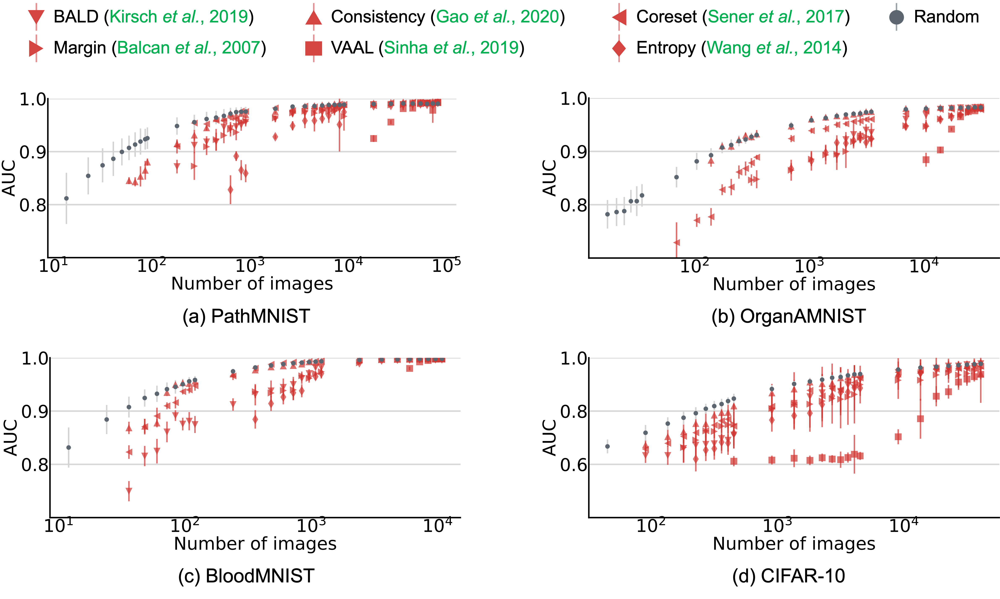

# Cold Start Problem in Vision Active Learning



Active learning promises to improve annotation efficiency by iteratively selecting the most important data to be annotated first. However, we uncover a striking contradiction to this promise: active learning fails to select data as efficiently as random selection at the first few choices. We identify this as the cold start problem in vision active learning, caused by a biased and outlier initial query. This paper seeks to address the cold start problem by exploiting the three advantages of contrastive learning: (1) no annotation is required; (2) label diversity is ensured by pseudo-labels to mitigate bias; (3) typical data is determined by contrastive features to reduce outliers. Experiments are conducted on CIFAR-10-LT and three medical imaging datasets (i.e. Colon Pathology, Abdominal CT, and Blood Cell Microscope). Our initial query not only significantly outperforms existing active querying strategies but also surpasses random selection by a large margin. We foresee our solution to the cold start problem as a simple yet strong baseline to choose the initial query for vision active learning.

## Paper
This repository provides the official implementation of the following paper:

<b>Making Your First Choice: To Address Cold Start Problem in Vision Active Learning</b> <br/>
[Liangyu Chen](https://c-liangyu.github.io/)<sup>1</sup>, [Yutong Bai](https://scholar.google.com/citations?user=N1-l4GsAAAAJ&hl=en)<sup>2</sup>, [Siyu Huang](https://siyuhuang.github.io/)<sup>3</sup>, [Yongyi Lu](https://scholar.google.com/citations?user=rIJ99V4AAAAJ&hl=en)<sup>2</sup>, [Bihan Wen](https://personal.ntu.edu.sg/bihan.wen/)<sup>1</sup>, [Alan L. Yuille](https://www.cs.jhu.edu/~ayuille/)<sup>2</sup>, and [Zongwei Zhou](https://www.zongweiz.com/)<sup>2</sup> <br/>
<sup>1 </sup>Nanyang Technological University,   <sup>2 </sup>Johns Hopkins University,   <sup>3 </sup>Harvard University <br/>
<i>NeurIPS 2022 Workshop on Human in the Loop Learning</i> <br/>
arXiv preprint arXiv:2210.02442, 2022 <br/>
[paper](https://arxiv.org/abs/2210.02442) | [code](https://github.com/c-liangyu/CSVAL)

To reproduce the benchmark results in our paper, please refer to [this repo](https://github.com/MrGiovanni/ColdStart).

## Installlation
This repo is developed on the basis of [open-mmlab/mmselfsup](https://github.com/open-mmlab/mmselfsup).
Please see [mmselfsup installation](https://mmselfsup.readthedocs.io/en/latest/install.html).

## Dataset Preparation

All datasets can be auto downloaded in this repo.

MedMNIST can also be downloaded at [MedMNIST v2](https://medmnist.com/).

CIFAR-10-LT is generated in this repo with a fixed seed.

## Pretrain
Pretrain on all MedMNIST datasets
```
bash tools/medmnist_pretrain.sh
```

Pretrain on CIFAR-10-LT
```
bash tools/cifar_pretrain.sh
```

## Select initial query
Select initial queries on all MedMNIST datasets
```
bash tools/medmnist_postprocess.sh
```

Select initial queries on CIFAR-10-LT
```
bash tools/cifar_postprocess.sh
```


## Citation
If you find this repo useful, please consider citing our paper:
```
@article{chen2022making,
  title={Making Your First Choice: To Address Cold Start Problem in Vision Active Learning},
  author={Chen, Liangyu and Bai, Yutong and Huang, Siyu and Lu, Yongyi and Wen, Bihan and Yuille, Alan L and Zhou, Zongwei},
  journal={arXiv preprint arXiv:2210.02442},
  year={2022}
}
```
